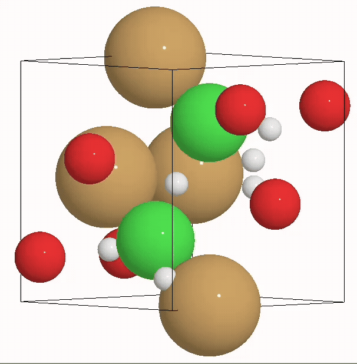
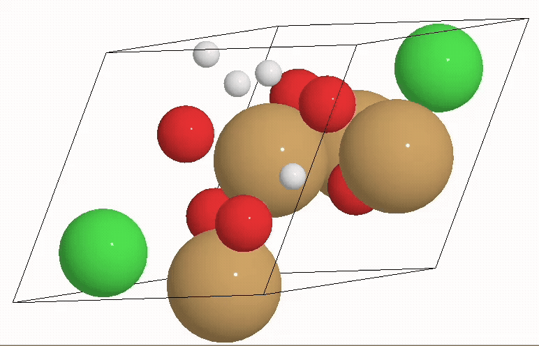
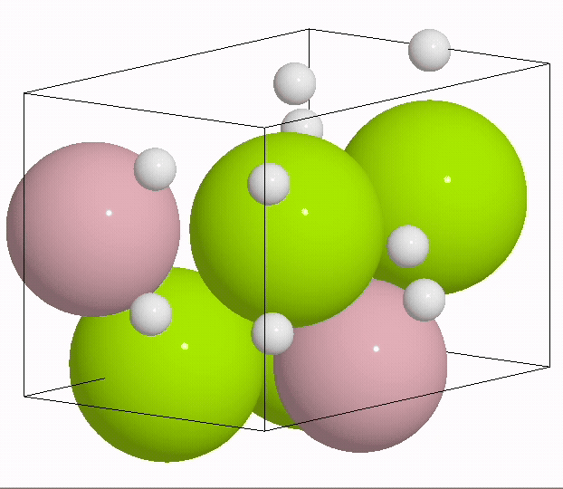
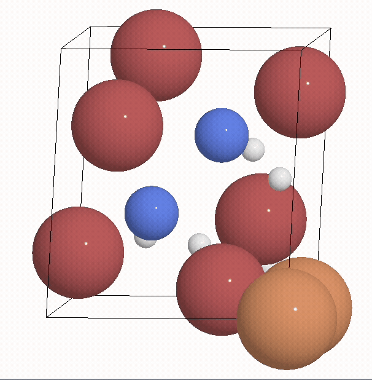

<p align="left">
  
</p>


# XtalPaint – A framework for crystal structure inpainting based on diffusion models

`XtalPaint` is a Python package that provides tools to perform crystal structure inpainting, i.e. adding atomic sites to a given host structure, using score-based diffusion models. Here, we provide retrained versions of the [`MatterGen`](https://github.com/microsoft/mattergen) architecture and the building blocks to set up the inpainting workflows. The initial application in our latest work: [Score-based diffusion models for accurate crystal-structure inpainting and reconstruction of hydrogen positions](https://doi.org/10.48550/arXiv.2601.01959), focuses on adding missing hydrogen sites to inorganic crystal structures, but the framework can be adapted to other inpainting tasks as well, i.e. general crystal structure prediction based on given host structures (see other interesting works in the field, e.g. by [Zhong _et al._](https://pubs.rsc.org/en/content/articlehtml/2025/mh/d5mh00774g)).

## Installation
The recommended way of installing the package is using [uv](https://docs.astral.sh/uv/getting-started/installation/). Note that `XtalPaint` requires `Python 3.10`.

If you don't have a virtual environment set up yet, you can create one using `uv` (the following example creates a virtual environment called `xtalpaint-env`, feel free to change the name):

```bash
uv venv xtalpaint-env --python 3.10
source xtalpaint-env/bin/activate
```

Then, you can install the package from the GitHub repository:

```bash
git clone https://github.com/psi-lms/XtalPaint.git
cd XtalPaint/

uv sync --active
```

This will install the default version. If you want to use it in combination with [AiiDA](https://aiida.readthedocs.io/projects/aiida-core/en/stable/), please also install the optional dependencies:

```bash
uv sync --extra aiida --active
```

### Model checkpoints for retrained versions of MatterGen

Model checkpoints for the retrained versions of MatterGen used in our work are hosted on [Hugging Face](https://huggingface.co/t-reents/XtalPaint). Currently, the repository contains the `pos-only` and `TD-pos-only` models discussed in the paper.

> [!IMPORTANT]
> **The example below uses the `TD-pos-only` model — the core model of XtalPaint — which we recommend for accurate inpainting**, together with the time-dependent (`TD`) predictor-corrector. See the [documentation](https://psi-lms.github.io/XtalPaint/configuration/) for the available model and predictor-corrector combinations.

Just like MatterGen's own checkpoints, the XtalPaint models are **downloaded automatically** the first time you select them by name — simply set `pretrained_name` to `"TD-pos-only"` (or `"pos-only"`):

```python
config = InpaintingConfig(
    pretrained_name="TD-pos-only",   # auto-downloaded & cached from Hugging Face
    predictor_corrector="TD",        # time-dependent predictor-corrector
    N_steps=50,
    coordinates_snr=0.2,
    n_corrector_steps=1,
    batch_size=100,
)
```

You can also download a checkpoint explicitly and point `model_path` at it:

```python
from xtalpaint.models import download_pretrained_model

model_path = download_pretrained_model("TD-pos-only")
```

## Example

The following animations show the inpainting process of hydrogen sites in a host crystal structure.

|                                                               |                                                               |
| :-----------------------------------------------------------: | :-----------------------------------------------------------: |
|   |   |
|   |   |


In the following, we show one example of how to use the inpainting models yourself.
More details can be found in the [documentation](https://psi-lms.github.io/XtalPaint/) and the corresponding examples, including the relaxation steps and the evaluation of inpainted structures against references.

```python
from ase.build import bulk

host_structures = {
  'Al': bulk('Al', cubic=True),
  'Si': bulk('Si', cubic=True),
}

from xtalpaint.inpainting.generate_candidates import (
    generate_inpainting_candidates,
)

# Inpaint 3 H sites to the Al structure and 2 O sites to the Si structure
inpainting_candidates = generate_inpainting_candidates(
    structures=host_structures,
    n_inp={'Al': 3, 'Si': 2},
    element={'Al': 'H', 'Si': 'O'},
    num_samples=1, # Number of samples per structure
)

from xtalpaint.inpainting.config_schema import InpaintingConfig
from xtalpaint.inpainting.inpainting_process import (
    run_inpainting_pipeline,
)

# Parameters for the inpainting, please adjust to reasonable values.
# This uses our recommended `TD-pos-only` model, which is downloaded
# automatically from Hugging Face the first time it is selected. See the
# documentation for the available model/predictor-corrector combinations.
config = InpaintingConfig(
    pretrained_name="TD-pos-only",
    predictor_corrector="TD",
    N_steps=50,
    coordinates_snr=0.2,
    n_corrector_steps=1,
    batch_size=100,
    record_trajectories=False,
    sampling_config_path=None, # ``None`` uses the sampling configs bundled with XtalPaint; potentially change it to point to another sampling config directory
)

results = run_inpainting_pipeline(
    structures=inpainting_candidates,
    config=config,
)
inpainted_structures = results["structures"]
```

## Citation

If you find this project useful in your research, please consider citing:


> Reents, T., Cantarella, A., Bercx, M., Bonfà, and Pizzi, G. Score-based diffusion models for accurate crystal-structure inpainting and reconstruction of hydrogen positions. *npj Comput. Mater.* **12**, 203 (2026). https://doi.org/10.1038/s41524-026-02090-1


```bibtex
@article{Reents2026,
  title = {Score-based diffusion models for accurate crystal-structure inpainting and reconstruction of hydrogen positions},
  volume = {12},
  ISSN = {2057-3960},
  url = {http://dx.doi.org/10.1038/s41524-026-02090-1},
  DOI = {10.1038/s41524-026-02090-1},
  number = {1},
  journal = {npj Computational Materials},
  publisher = {Springer Science and Business Media LLC},
  author = {Reents,  Timo and Cantarella,  Arianna and Bercx,  Marnik and Bonfà,  Pietro and Pizzi,  Giovanni},
  year = {2026},
  month = June
}
```

## Acknowledgements

The initial version of this project relies on and implements extensions to [`MatterGen`](https://github.com/microsoft/mattergen). Please also consider citing the corresponding publication by [Zeni _et al._](https://doi.org/10.1038/s41586-025-08628-5).


All modules that are reused or adapted from [`MatterGen`](https://github.com/microsoft/mattergen) are clearly marked in the codebase.
